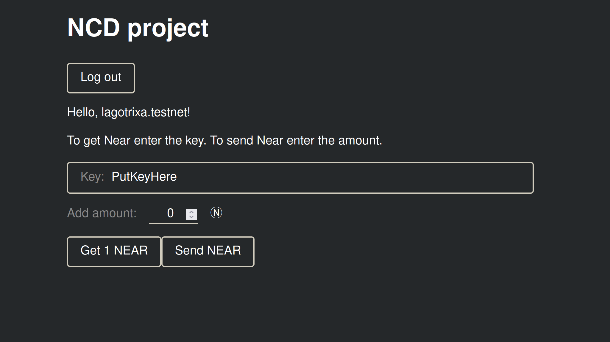

NCD project (Near Wallet)
=================================

[](https://gitpod.io/#https://github.com/Lagotrixa/NCD_project/)

<!-- MAGIC COMMENT: DO NOT DELETE! Everything above this line is hidden on NEAR Examples page -->

## Description

The basis of the project is the repositories [Guest book in AS](https://github.com/near-examples/guest-book), [Simple counter in Rust](https://github.com/near-examples/rust-counter), [Lottery](https://github.com/ryantanwk/lottery). Used information from sources [Near SDK docs](https://www.near-sdk.io/contract-interface/payable-methods), [Examples near](https://examples.near.org/).
Contract in `contract/src/lib.rs` provides methods get/send Near. Only those users who know the passphrase (key) can receive Near tokens. Any participants can send Near to a smart contract.



## To Run
Open in the Gitpod link above or clone the repository.

```
git clone https://github.com/Lagotrixa/NCD_project
```


## Setup [Or skip to Login if in Gitpod](#login)
Install dependencies:

```
yarn
```

If you don't have `Rust` installed, complete the following 3 steps:

1) Install Rustup by running:

```
curl --proto '=https' --tlsv1.2 -sSf https://sh.rustup.rs | sh
```

([Taken from official installation guide](https://www.rust-lang.org/tools/install))

2) Configure your current shell by running:

```
source $HOME/.cargo/env
```

3) Add wasm target to your toolchain by running:

```
rustup target add wasm32-unknown-unknown
```

Next, make sure you have `near-cli` by running:

```
near --version
```

If you need to install `near-cli`:

```
npm install near-cli -g
```

## Login
If you do not have a NEAR account, please create one with [NEAR Wallet](https://wallet.testnet.near.org).

In the project root, login with `near-cli` by following the instructions after this command:

```
near login
```

Modify the top of `src/config.js`, changing the `CONTRACT_NAME` to be the NEAR account that was just used to log in.

```javascript
…
const CONTRACT_NAME = 'YOUR_ACCOUNT_NAME_HERE'; /* TODO: fill this in! */
…
```

Start the example!

```
yarn start
```

## To Test

```
cd contract
cargo test -- --nocapture
```

## To Explore

- `contract/src/lib.rs` for the contract code
- `src/index.html` for the front-end HTML
- `src/main.js` for the JavaScript front-end code and how to integrate contracts

## To Build the Documentation

```
cd contract
cargo doc --no-deps --open
```
